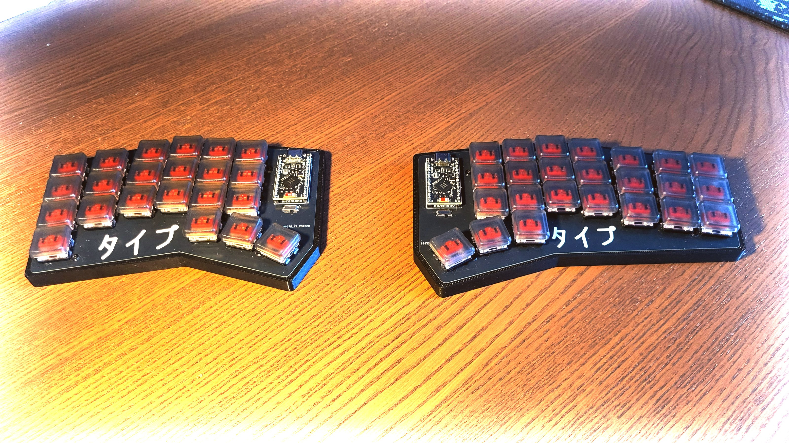

# Taipu

Taipu is a highly ergonomic, split mechanical Bluetooth keyboard I designed as a DIY project. My goal was to make it look 'barebone' with as much components visible just because I like it. I designed it with Polish language users in mind.

 

## Features

- Ergonomic Split Design

- Highly Customizable ZMK Layout (https://nickcoutsos.github.io/keymap-editor/)

- Wireless Connectivity

- Barebones Aesthetic

- Polish-Language Optimized

###  Ergogen 

In the `./ergogen/` directory contain the ergogen configuration of taipu. It generates the pcb with out traces and stl files needed to 3d print the case. The kicad handles cicurity of pcb (`./kicad/` directory).

### Firmware 

For firmware I have use ZMK framework. The configuration is avaiable `./taipu-zmk-config/`. Ready compiled firmware files one can find at the Github Action page on the `taipu-zmk-config` submodule.

